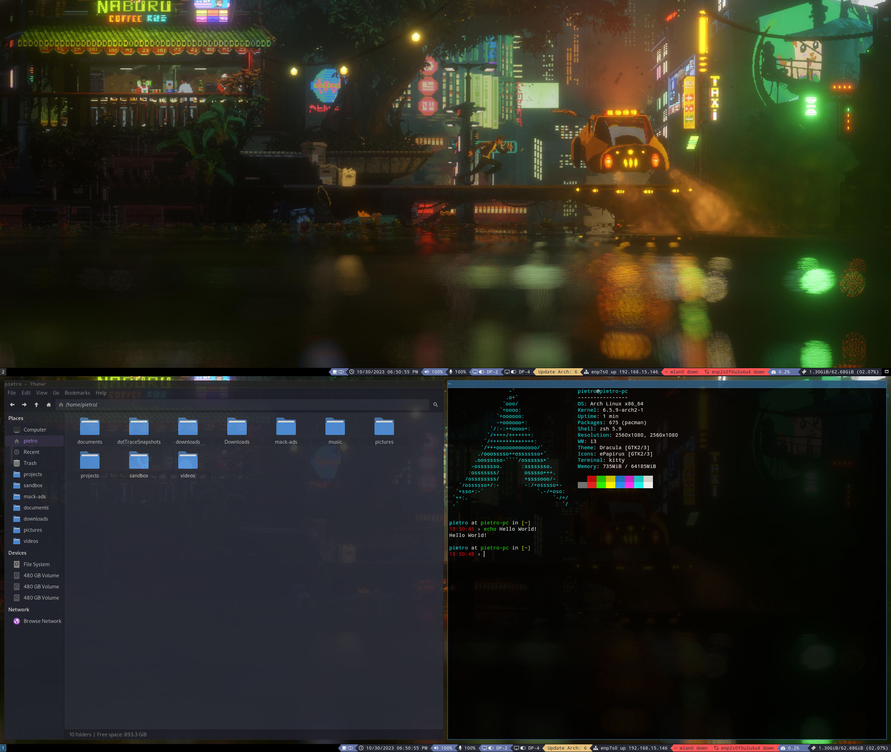

# i3 Dots

Just another i3 rice.

Screenshot:



## Configuring Wi-Fi (When not in cable)

Start iwd service if not started:

```bash
systemctl start iwd
```

```bash
systemctl enable iwd
```

Add this config to iwd config file so it can configure ip and all stuff automatically:

```bash
cat << 'EOF' | sudo tee /etc/iwd/main.conf
[General]
EnableNetworkConfiguration=true

[Network]
NameResolvingService=systemd
RoutePriorityOffset=300
EnableIPv6=true
EOF
```

Now setup yout connection, here is some helpful commands:

```bash
# Open iwctl
iwctl
```

```bash
# list all available Wi-Fi devices by typing, it typically looks like `wlan0` or `wlp2s0`
device list
```

```bash
# scan for networks with your device
station device_name scan
```

```bash
# see the available networks
station device_name get-networks
```

```bash
# connect to some wifi network from listed networks, you will be prompted to enter the passphrase, type and you are all set up
station device_name connect SSID
```

After successfully connecting, you can verify your IP address with `ip addr` or `ip a` to ensure you have been assigned an IP by the router.

## Setting up the `yay` AUR helper

The Arch User Repository (AUR) provides a collection of user-contributed packages. `yay` is a helper that makes it easier to manage these packages. First, you need to install `yay`:

```bash
# Install necessary dependencies
pacman -S --needed git base-devel
```

```bash
# Clone the `yay` repository and install
git clone https://aur.archlinux.org/yay.git
```

```bash
cd yay
```

```bash
makepkg -si
```

## Installing Dependencies

These are the foundational packages required for setting up the system.

```bash
# General dependencies
yay -S linux-headers base-devel wget git curl xorg-xrandr arandr man-db git-lfs
```

```bash
# i3
yay -S i3 i3status i3lock-colors i3blocks bumblebee-status
```

```bash
# Theming and appearance
yay -S xfce4-settings gtk3 dracula-gtk-theme dracula-icons-git lxappearance materia-gtk-theme papirus-icon-theme bibata-cursor-theme vimix-cursors
```

```bash
# Utilities and system tools
yay -S gvfs polkit-gnome rofi dunst brightnessctl pavucontrol xclip feh polybar picom gnome-keyring seahorse btop man-db pacman-contrib vi vim neovim mpd mpc flameshot neofetch timeshift gparted bluez bluez-utils blueman nm-connection-editor networkmanager-openvpn qimgv zsh thunar thunar-archive-plugin xarchiver lm_sensors htop onlyoffice-bin simplescreenrecorder
```

```bash
# Font essentials
yay -S otf-font-awesome ttf-jetbrains-mono-nerd ttf-jetbrains-mono otf-font-awesome-4 ttf-droid ttf-fantasque-sans-mono adobe-source-code-pro-fonts noto-fonts-emoji ttf-ms-fonts
```

```bash
# Document viewers
yay -S zathura zathura-pdf-mupdf
```

```bash
# Communication and media apps
yay -S discord spotify
```

## Start Services

```bash
sudo systemctl enable bluetooth.service
```

## Setting up Zsh with Oh My Zsh

Zsh is an advanced shell, and Oh My Zsh is a framework for managing Zsh configurations.

```bash
# Install Oh My Zsh
sh -c "$(curl -fsSL https://raw.githubusercontent.com/ohmyzsh/ohmyzsh/master/tools/install.sh)"
```

```bash
# Add autosuggestions plugin
git clone https://github.com/zsh-users/zsh-autosuggestions ~/.oh-my-zsh/custom/plugins/zsh-autosuggestions
```

```bash
# Add syntax highlighting plugin
git clone https://github.com/zsh-users/zsh-syntax-highlighting.git ~/.oh-my-zsh/custom/plugins/zsh-syntax-highlighting
```

```bash
# Adjust permissions
chmod 700 ~/.oh-my-zsh/custom/plugins/zsh-syntax-highlighting
```

## Firewall

```bash
# Install UFW
yay -S ufw gufw
```

```bash
# Enable UFW
sudo systemctl enable ufw
```

```bash
# Start UFW
sudo systemctl start ufw
```

Now open the gui and turn on the firewall.

## Timeshift

Timeshift is a system restore utility for Linux. It creates incremental snapshots of the file system at regular intervals, and allows you to easily restore the system to a previous state.

```bash
# Install Timeshift
yay -S timeshift
```

Open timeshift and use the wizard to configure scheduled snapshots of the system. After that ensure the service `cronie` is enabled and running:

```bash
# Enable and start cronie
sudo systemctl enable cronie
```

```bash
sudo systemctl start cronie
```

## SSH keys

For github (and other services), generate a SSH key:

```bash
ssh-keygen -t ed25519 -C "dev@pietrobondioli.com.br"
```

Azure only supports RSA keys, so if you want to use Azure, you need to generate an RSA key:

```bash
ssh-keygen -t rsa -b 4096 -C "dev@pietrobondioli.com.br"
```

Eval the ssh-agent:

```bash
eval "$(ssh-agent -s)"
```

Add ed25519 key to ssh-agent:

```bash
ssh-add ~/.ssh/id_ed25519
```

Get the public key to add to services:

```bash
cat ~/.ssh/id_ed25519.pub
```

Add rsa key to ssh-agent:

```bash
ssh-add ~/.ssh/id_rsa
```

Get the public key to add to services:

```bash
cat ~/.ssh/id_rsa.pub
```

## Nvidia config

### Default Prerequisites

- If you are using anything other than the regular linux kernel, such as linux-lts, you need to make changes accordingly.
- Do not reboot before you have finished all the steps below.

### Step 1: Installing the driver packages

1. This step might be a bit confusing. First find your [nvidia card from this list here](https://nouveau.freedesktop.org/CodeNames.html)
2. After reading if you still don't know what driver you need, take a look of that list on gentoo wiki [here](https://wiki.gentoo.org/wiki/NVIDIA#Feature_support) that lists the latest driver that supports your CHIPSET. For example, if you have a GTX 3060, you need to install the latest version of nvidia, so just `yay -S nvidia nvidia-utils lib32-nvidia-utils`.
3. Check what driver packages you need to install from the list below

| Driver name                                      | Base driver       | OpenGL             | OpenGL (multilib)        |
| ------------------------------------------------ | ----------------- | ------------------ | ------------------------ |
| Maxwell (NV110) series and newer                 | nvidia            | nvidia-utils       | lib32-nvidia-utils       |
| Kepler (NVE0) series                             | nvidia-470xx-dkms | nvidia-470xx-utils | lib32-nvidia-470xx-utils |
| GeForce 400/500/600 series cards [NVCx and NVDx] | nvidia-390xx      | nvidia-390xx-utils | lib32-nvidia-390xx-utils |

1. Install the correct packages, for example `yay -S nvidia-470xx-dkms nvidia-470xx-utils lib32-nvidia-470xx-utils`
2. I also recommend you to install nvidia-settings via `yay -S nvidia-settings`

In my case I have a GeForce RTX 3060 Ti, which is a NV110 card, so I installed the following packages:

```bash
yay -S nvidia nvidia-utils lib32-nvidia-utils
```

### Step 2: Enabling DRM kernel mode setting

1. Add the kernel parameter

   A. If you are using grub:

   - Go to your grub file with `sudo nano /etc/default/grub`
   - Find `GRUB_CMDLINE_LINUX_DEFAULT`
   - Append the line with `nvidia-drm.modeset=1`
   - For example: `GRUB_CMDLINE_LINUX_DEFAULT="quiet splash nvidia-drm.modeset=1"`
   - Save the file with _CTRL+O_
   - Finish the grub config with `sudo grub-mkconfig -o /boot/grub/grub.cfg`

   B. If you are using systemd-boot:

   - Go to your systemd-boot file with `sudo nano /boot/loader/entries/arch.conf`
   - Find `options`
   - Append the line with `nvidia-drm.modeset=1`
   - For example: `options root=UUID=xxxxxxxx-xxxx-xxxx-xxxx-xxxxxxxxxxxx rw quiet nvidia-drm.modeset=1`
   - Save the file

In my case I am using systemd-boot, so my file was:

```bash
# Created by: archinstall
# Created on: 2023-10-29_22-09-49
title   Arch Linux (linux)
linux   /vmlinuz-linux
initrd  /amd-ucode.img
initrd  /initramfs-linux.img
options root=PARTUUID=1a3bdf5e-4121-47cf-b93c-df8686e8bf49 zswap.enabled=0 rootflags=subvol=@ rw rootfstype=btrfs
```

And I changed it to:

```bash
# Created by: archinstall
# Created on: 2023-10-29_22-09-49
title   Arch Linux (linux)
linux   /vmlinuz-linux
initrd  /amd-ucode.img
initrd  /initramfs-linux.img
options root=PARTUUID=1a3bdf5e-4121-47cf-b93c-df8686e8bf49 zswap.enabled=0 rootflags=subvol=@ rw rootfstype=btrfs nvidia-drm.modeset=1
```

2. Add the early loading

- Go to your mkinitcpio configuration file with `sudo nano /etc/mkinitcpio.conf`
- Find `MODULES=()`
- Edit the line to match `MODULES=(nvidia nvidia_modeset nvidia_uvm nvidia_drm)`
- Save the file with _CTRL+O_
- Finish the mkinitcpio configuration with `sudo mkinitcpio -P`

3. Adding the pacman hook

- Find the _nvidia.hook_ in this repository ([here](./nvidia/nvidia.hook)), make a local copy and open the file with your preferred editor
- Find `Target=nvidia`
- Replace the _nvidia_ with the base driver you installed, e.g. `nvidia-470xx-dkms`
- Save the file and move it to `/etc/pacman.d/hooks/` , for example with `sudo mv ./nvidia.hook /etc/pacman.d/hooks/`

## Development

These are packages and utilities related to software development.

### IDEs

```bash
# Install Visual Studio Code and Rider
yay -S visual-studio-code-bin rider
```

Change vscode desktop to exec from shell to fix PATH issues:

```bash
# Open vscode desktop file
sudo vim /usr/share/applications/code.desktop
```

```bash
# Change the exec line to
Exec=zsh -i -c "code"
```

### Node.js with Nvm

Nvm (Node Version Manager) allows you to easily manage multiple versions of Node.js.

```bash
# Install Nvm
curl -o- https://raw.githubusercontent.com/nvm-sh/nvm/v0.39.5/install.sh | bash
```

```bash
# Install the latest LTS (Long Term Support) version of Node.js
nvm install lts
```

### .NET Development

.NET is a free, cross-platform, open-source developer platform for building many different types of applications.

```bash
# Install essential .NET packages
yay -S dotnet-targeting-pack-6.0 dotnet-runtime-6.0 dotnet-sdk-6.0 dotnet-runtime dotnet-host dotnet-sdk

# Optional: Install preview versions of .NET packages
yay -S dotnet-targeting-pack-bin dotnet-runtime-bin dotnet-sdk-bin dotnet-host-bin aspnet-targeting-pack-bin aspnet-runtime-bin aspnet-targeting-pack-6.0 aspnet-targeting-pack aspnet-runtime-6.0 aspnet-runtime
```

### Docker

Docker is a set of platform as a service products that use OS-level virtualization to deliver software in packages called containers.

```bash
# Install Docker
yay -S docker docker-compose
```

```bash
# Enable and start Docker
sudo systemctl enable docker.service
```

```bash
sudo systemctl start docker.service
```

```bash
# Add your user to the docker group
sudo usermod -aG docker $USER
```

Now you need to logout and login again to apply the changes.

## Database Tools

```bash
# Install DBeaver
yay -S dbeaver
```

---
